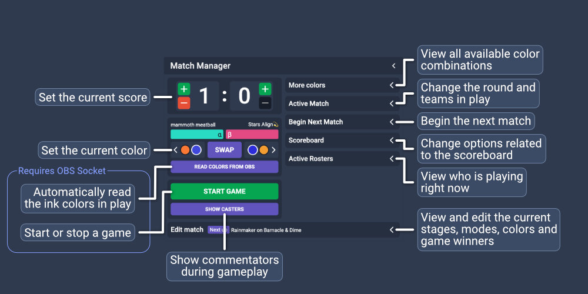

# User's guide

## Installation

### Regular installation

1. Install [Node.js](https://nodejs.org/en/) - Using the LTS version (16.x as of writing) is recommended.

2. Install [Git](https://git-scm.com/)

3. Install [nodecg-cli](https://github.com/nodecg/nodecg-cli): `npm i -g nodecg-cli`

4. Create a directory for NodeCG: `mkdir nodecg && cd nodecg`

5. Install NodeCG: `nodecg setup`

6. Install ipl-overlay-controls: `nodecg install inkfarer/ipl-overlay-controls`.

     * To specify a version, append `#<tag>` after the repository name.  
       Example: `nodecg install inkfarer/ipl-overlay-controls#1.3.2`  
       Find a list of the repository's releases [here](https://github.com/inkfarer/ipl-overlay-controls/releases).
       You can see the tag name next to the commit hash, located on the left-hand side of the page on desktop.

7. Run NodeCG by running `nodecg start` in the NodeCG install directory

8. Access the dashboard at `http://localhost:9090/` in your browser.

### Installation with NCGMGR

NCGMGR is a GUI interface for managing a NodeCG installation, developed by the same group as ipl-overlay-controls.  
View an installation guide for NCGMGR at its [documentation page.](https://ncgmgr.readthedocs.io/en/latest/users-guide/#installation)  
Install ipl-overlay-controls in NCGMGR by clicking the "Plus" icon in the bundle management section and typing `inkfarer/ipl-overlay-controls` as the repository name.

## Configuration

### Setting authentication keys

For some features of ipl-overlay-controls to function properly, some configuration parameters must be set.  
To start, create the configuration file at `<nodecg>/cfg/ipl-overlay-controls.json`
A complete configuration file contains the following parameters:

```json
{
  "lastfm": {
    "apiKey": "Your last.fm API key",
    "secret": "Your last.fm API secret"
  },
  "smashgg": {
    "apiKey": "Your smash.gg API key"
  },
  "radia": {
    "url": "https://radia-production",
    "socketUrl": "wss://radia-websocket",
    "authentication": "Your authentication key"
  },
  "sendouInk": {
    "apiKey": "Your sendou.ink API key"
  }
}
```

Any configuration parameters may be omitted from the file, but functionality will be missing if that is done.

### Settings in the dashboard

Some settings in ipl-overlay-controls are available through the dashboard.  
After starting NodeCG, visit the dashboard and select the "IPL Setup" workspace from the top of the screen.
The settings will be visible in the "Settings" panel.

#### Last.fm

Allows to set which [Last.fm](https://www.last.fm/) account to get the currently playing song from.

#### Radia

Provides options for what guild ID to use when getting commentator and prediction information from [Radia Productions.](https://github.com/IPLSplatoon/Radia-Productions)

The "Update tournament data on import" toggle will automatically update the tournament name and bracket link stored in Radia when tournament data is imported. [More on importing tournament data](#importing-team-data)

#### Game version

Toggles the dashboard between Splatoon 2 and Splatoon 3 game data. A warning will be displayed when switching to a different game's data may cause compatibility issues in any of the installed graphics packages.  
Currently, the full list of stages, modes and colors for Splatoon 3 is unknown and thus the data will be incomplete.

#### OBS Socket

Provides configuration for an OBS websocket connection. Requires obs-websocket version 4.  
[Read more about obs-websocket here.](https://github.com/obsproject/obs-websocket#readme)

Enable the socket, input a server address and password and click on "Connect" to connect to an OBS instance.  
To be able to automatically start and end games, select a gameplay and intermission scene from the options provided.

## Installing graphics

ipl-overlay-controls is not very useful without a graphics package accompanying it.  
A list of bundles that use ipl-overlay-controls can be found [here.](../dependent-bundles)  
You may use these bundles as a reference point for your own broadcasts, but using them verbatim in your own work is forbidden.    
The ipl-overlay-controls dashboard is free to use, though we would appreciate an acknowledgement on your broadcast or tournament information page.

## Before starting a stream

A couple steps should be undergone before starting a broadcast using ipl-overlay-controls.

### Importing team data


To import team data, visit the "IPL Setup" workspace from the top of the NodeCG dashboard. Under the "Data import/export"
panel, select where to import data from, input an ID for the tournament and select "Import". 

- For smash.gg, the tournament ID is its "Slug". For example, when the tournament URL is `smash.gg/tournament/riptide-2022/details`, the slug will be `riptide-2022`
- For Battlefy, a full tournament URL may be used. For example: `https://battlefy.com/inkling-performance-labs/low-ink-april-2022/6247a1b52b7fa6066d2aa144/info?infoTab=details`
- For sendou.ink, a full tournament URL may be used. For example: `https://sendou.ink/to/5/brackets`
- For uploaded files, provide a link to a JSON file hosted anywhere on the web or upload one from your local machine using the "Upload file" checkbox.   
  There are two possible JSON formats that can be used when importing custom team data: [Example 1](https://github.com/inkfarer/ipl-overlay-controls/blob/master/examples/example-tournament-data2.json), [Example 2](https://github.com/inkfarer/ipl-overlay-controls/blob/master/examples/example-tournament-data.json)

When team data is imported successfully, it will show up under the "Saved data" section of the panel.  
You may now set a "Short name" for the tournament. You will find this option under the "Saved data" panel. The short name will show up on the scoreboard during matches.

### Defining rounds

#### Importing rounds from JSON

ipl-overlay-controls offers the possibility of importing lists of rounds from a JSON file. 
The format of a round list JSON file must follow [this example.](https://github.com/inkfarer/ipl-overlay-controls/blob/master/examples/example-maps.json)  
You will find the option to import rounds under the "Data import/export" panel.
Enter a URL or upload a file from your computer and click "Import" to import a list of rounds.

[The IPL map generator](https://maps.iplabs.ink/) can be used to generate rounds before importing them to ipl-overlay-controls.

#### Defining rounds manually


Rounds can be defined manually in the "Rounds" panel of the dashboard.

_Tip for selecting stages and modes:_ In most modern browsers, typing while a select box is open will allow you to search
for options. For example, typing "sn" with a stage selection box open will select Snapper Canal.

### Casters


To manage casters, use the "Casters" panel in the main IPL workspace.  
When it is configured, casters can be imported automatically from a [Radia Productions](https://github.com/IPLSplatoon/Radia-Productions) server.  
More info about configuring Radia can be found [here](#configuration) and [here.](#radia)

## During a stream

This section describes common actions during a tournament broadcast.

### Setting the next match


ipl-overlay-controls allows to import highlighted matches from Battlefy and stream queue data from smash.gg.

#### Importing matches from Battlefy

To receive match data from Battlefy, ask a tournament organizer to highlight matches to be shown on the broadcast. This option is visible to administrators on Battlefy match pages.


#### Importing matches from smash.gg

To receive match data from smash.gg, a tournament organizer must assign the desired matches to a stream queue.

Read more about managing streams in smash.gg [here](https://help.start.gg/en/articles/1465692-adding-streams-and-creating-stations) and [here.](https://help.start.gg/en/articles/1465715-assigning-individual-matches-to-a-station)

#### Selecting the next match manually

To select the next match manually, select the "Choose teams manually" option at the top of the "Next Match" dashboard panel.

### Starting a match

Actions related to the ongoing match are contained in the "Match Manager" dashboard panel.



To start a match, select "Begin Next Match" in the Match Manager panel. Review the teams and round, and input a suitable
name for the match if desired. Click "Begin next match" and confirm the action.

After starting a match, the "Active Match" section may be used to change the match's teams and name or select a different
match to play.

### Managing ink colors

When a game starts, use the "More colors" section of the Match Manager panel to pick the colors in play.  
On the left side of the dashboard panel, a preview of the colors in play is shown. The colors may be swapped if they are
incorrect for the current match.  
The color for the "Alpha" team in-game is designated by the "α" symbol and the color for the "Bravo" team in-game is designated by the "β" symbol.  
The left side of the dashboard can be used to switch to the previous and next color in the sequence of colors. When each
game is played  in the same private battle room, the colors follow a predictable order, which is followed by the dashboard. 
(Although, please note that ranked modes and turf war have separate sets of ink colors)

### Showing and hiding the scoreboard

Use the "Scoreboard" section of the Match Manager panel to show and hide the scoreboard. It also displays a preview of
the flavor text that will be shown on the scoreboard.

### Using the OBS socket

The OBS websocket connection in ipl-overlay-controls can be used to:

- Switch scenes between gameplay and intermission in OBS
- Show and hide the scoreboard
- Switch to the next color automatically
- Show commentators when a match starts

Read more about configuring the OBS socket [here.](#obs-socket)

When OBS is not on the gameplay scene, an option to start a game will be available on the Match Manager panel.  
It is intended to be selected immediately after the game is finished loading and the match intro is playing.

When OBS is on the gameplay scene, an option to end the game will be available.  
It is intended to be selected after the game's winner has been revealed by Judd and Li'l Judd and the alpha team's
players are shown. [Photo reference](img/end-game-timing-reference.png)

### Running counterpicks

Counterpicks are most easily handled using the "Edit match" section of the Match Manager panel. Use it to select the stages
and modes being played as they are picked. It may also be used to set which team won any specific games, and which colors
were played during them.

### Running intermissions between games

Use the "Break Screen" dashboard to manage intermissions between games.

Show the "Main Scene" option to display a general intermission screen, useful when between matches.  
Expand the "Main Scene" section to set a general flavor text and an estimate for when the next game will be played.

Use the "Teams" option to display the teams playing in the active round, their rosters and other details.

Use the "Stages" option to display what stages and modes are in play in the current round.

### Running predictions

ipl-overlay-controls can integrate with [Radia Productions](https://github.com/IPLSplatoon/Radia-Productions) to automate managing Twitch predictions.  
**This functionality is not available to the public.** It may be released at a later date.

When possible, the "Predictions" dashboard panel displays information about the latest prediction at the top and
controls to create, lock, resolve or cancel the prediction at the bottom.

To create a prediction, click "New" at the bottom of the panel. The title, duration and outcomes will automatically be 
filled out for you. Click "Create" to send the prediction to Twitch. Some team names may be considered inappropriate by
Twitch, in which case they must be modified.  
Click "Reset" on the prediction creation dialog to reset all values in it.

While a prediction is in progress, you may either cancel or lock it. Cancelling a prediction will refund all points 
predicted and stop the prediction, while locking it stops more points from being predicted.

When a match has ended, click "Resolve" to end the prediction. In most cases, the correct winner will be
highlighted based on who won the active match.

## After a stream

### Exporting match data

In the Data import/export panel under the IPL Setup workspace, it is possible to export the data of each match played
on the stream under the "Match data" section.  
The data will be exported as a JSON file. No utilities exist to parse this data for the time being.
